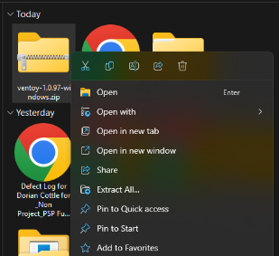
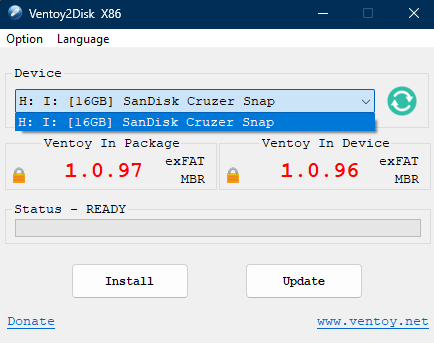
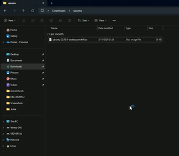
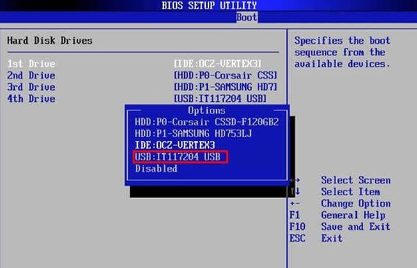
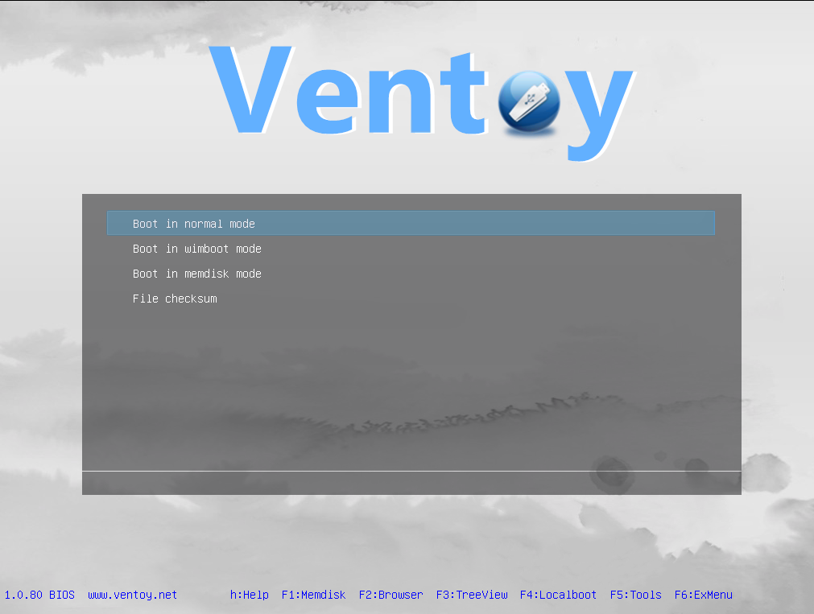
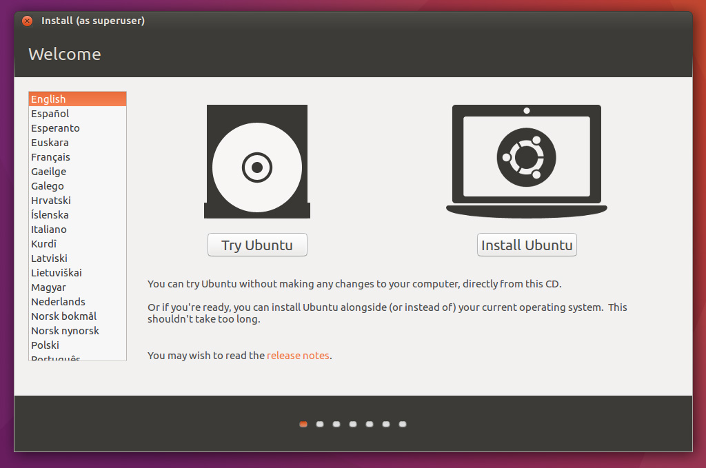
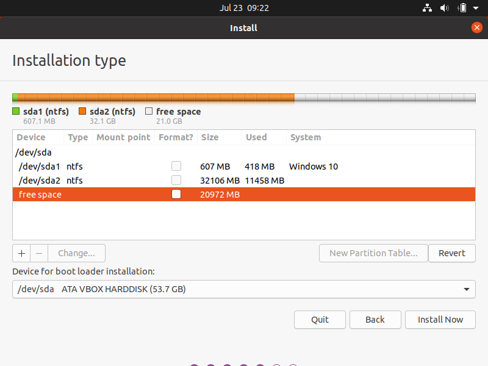

# Installing Ubuntu Linux on a Computer: A Step-by-Step Guide

## Introduction

Linux-based operating systems recently surpassed 4% of the consumer desktop market share, so I wanted to teach others how to download it. There are hundreds of variations of Linux operating systems, called distributions or "distros," and the one typically recommended for beginners is called Ubuntu, which is what we will be installing today.

**Time frame:** 1hr

 

**Prerequisites**

1. A computer with an existing operating system (for creating the USB drive).
2. A target computer for the Linux installation  (Note: the installation process will erase everything from this computer. Back up any files you don't want to lose beforehand!)
3. Obtain the following software on the existing computer:
    * **Ventoy:** go to [https://sourceforge.net/projects/ventoy/files/v1.0.97/](https://sourceforge.net/projects/ventoy/files/v1.0.97/) then click on the 

 button to download Ventoy.

    * **Ubuntu image:** go to [https://ubuntu.com/download/desktop](https://ubuntu.com/download/desktop) and click the download button that corresponds to the operating system you currently have.
4. Obtain the following hardware:
    * A USB drive with at least 8 GB of storage (16 GB if you really want to be safe). This is for loading Ubuntu onto your computer for the first time.
5. A reliable internet connection.

## Step-by-Step Instructions

1. Creating the Bootable USB Drive:
    * Right-click on the Ventoy .zip file you downloaded.

    * Click "extract all." 
    
    

    * Go into the folder that was extracted and double-click "Ventoy2Disk.exe"

    * Select the USB drive you want to use and click "Install."

    

    * Once Ventoy is installed, copy the Linux distribution file onto the USB drive. This can be done by dragging and dropping the file directly onto the USB drive, which should have been renamed to "Ventoy" when you installed Ventoy. 

    

2. Configuring BIOS/UEFI:
    * Turn on the computer you want to install Ubuntu on. When prompted by the message on screen, press F2, Del, or similar keys according to what the boot menu says, to enter the BIOS/UEFI.

    * Locate the boot sequence menu and set the USB drive as the primary boot device.

      

    * Ensure that any settings called "Secure boot" are disabled if that option exists.

    *  Save changes and exit BIOS/UEFI.

3. Starting the Linux Installation:
    * Insert the bootable USB drive into the target computer and reboot.

    * You should see the Ventoy startup screen. Select the Linux distribution to start the installation process, and select normal boot from the Ventoy screen. Then select try or install ubuntu.

      

    * Follow the on-screen instructions to complete the installation. 

        * Choose a language

      

        * Partition drives (this means choose which data disk you want Ubuntu to be installed on) 

      

        * Choose Full install or Default install

            * Full install is recommended for new users. It includes apps that you would typically expect to be on a computer such as notes and internet browsing.

            * Default install takes less space, but it only installs the absolute necessities.

        * Create a user account.

## Post-Installation Tasks

* Go to the BIOS and re-activate Secure Boot if you disabled that in step 2.
* System Update:
    * After installation, ensure the system is up to date by running any available updates. Ubuntu will sometimes send you a prompt to do this automatically, but you can do it by opening up the Terminal app and typing "sudo apt update && sudo apt upgrade" then press enter.

## Troubleshooting Common Issues

* USB Drive Not Recognized: Check BIOS/UEFI settings to ensure USB booting is enabled.
* Installation Fails: Verify the hardware requirements for the chosen distribution.
* USB Drive Not Working: Try a different USB drive or re-create the bootable drive with Ventoy.

## Conclusion

After that, you should be good to start using Ubuntu Linux! For additional help and resources, visit [https://ubuntu.com/support/community-support](https://ubuntu.com/support/community-support)